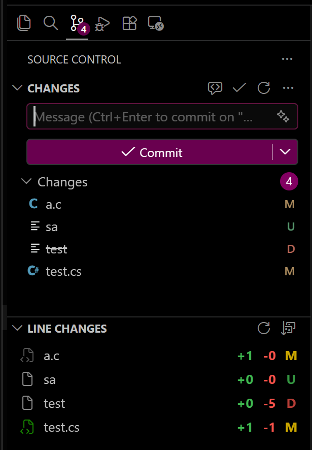

# Git Line Count Summary

Shows added and removed line counts for each changed file in the Source Control sidebar.

## Features

- Displays **+added / -removed** line counts next to each changed file
- Color-coded status letters: **M** (yellow), **U** (green), **D** (red), **A** (green), **R** (blue)
- Colored file type icons for common languages (TypeScript, JavaScript, Python, C#, Go, Rust, etc.)
- Click a file to open it; click a deleted file to view its diff
- Sort by name, added lines, deleted lines, or status (click again to reverse)
- Auto-refreshes on file changes

## Requirements

- Git must be installed and available in your PATH
